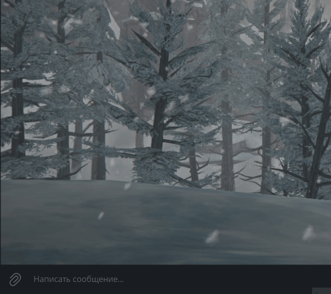

# Speech recognizer

This project includes two chatbots and a script for adding intents:
- telegram_bot_recognizer.py allows interactive with the user in the Telegram application
- vk_bot_recognizer.py allows interactive with the user in the VK application
- create_intent.py automates the addition of new intents and automatic responses

The project is implemented using the dialogflow resource https://cloud.google.com/dialogflow/docs.

The project is designed to automate the processing of incoming requests from users of resources (telegram, vk) and reduce the workload on first-line support operators.


## Enviroments

To work with the telegram_bot_recognizer.py application:
- create two bots (you can obtain bot from @BotFather in Telegram) and get tokens from them, one bot for the chatbot, the second for error monitoring
  (you can obtain bot from @BotFather in Telegram, [See example](https://telegra.ph/Awesome-Telegram-Bot-11-11))
- create the file .env and fill in this data:
  - TELEGRAM_API_TOKEN
  - TELEGRAM_MONITOR_API_TOKEN
  - GOOGLE_APPLICATION_CREDENTIALS here you need to specify the path to the credentials.json file with access keys (see the Installing section).
  - TELEGRAM_CHAT_ID a unique identifier of the telegram administrator of the chatbot, to whom possible errors will be directed
  - GOOGLE_CLOUD_PROJECT a unique identifier of the google cloud project (see the Installing section)
  TELEGRAM_CHAT_ID a unique identifier of the telegram administrator of the chatbot, to whom possible errors will be directed
    
To work with the vk_bot_recognizer.py application:
- create bot (you can obtain bot from @BotFather in Telegram) and get token from it
- create an open vk group and get a token from it
- create the file .env and fill in this data:
  - VK_API_TOKEN - token from the vk group
  - TELEGRAM_MONITOR_API_TOKEN
  - TELEGRAM_CHAT_ID a unique identifier of the telegram administrator of the vk chatbot, to whom possible errors will be directed
  - GOOGLE_APPLICATION_CREDENTIALS here you need to specify the path to the credentials.json file with access keys (see the Installing section).
  - GOOGLE_CLOUD_PROJECT a unique identifier of the google cloud project (see the Installing section)


## Installing

To get started go to terminal(mac os) or CMD (Windows)
- create virtualenv, [See example](https://python-scripts.com/virtualenv)

- clone github repository or download the code

```bash
$git clone https://github.com/Rostwik/speech_recognizer.git
```

- install packages

```bash
$pip install -r requirements.txt
```
- run the program 
```bash
$python telegram_bot_recognizer.py
```

Before running the programs, you need to connect dialogflow:
1. Create an account [dialogflow](https://dialogflow.cloud.google.com/#/login)
2. Create a project [dialogflow project](https://cloud.google.com/dialogflow/docs/quick/setup)
3. [Create an agent](https://cloud.google.com/dialogflow/docs/quick/build-agent) (important: the agent must use the project identifier obtained in step 2)
4. Add intents through the create_intent.py script (an example file can be viewed in the 'files' folder)
5. [Enable API](https://cloud.google.com/dialogflow/es/docs/quick/setup#api)
6. Install the utility [gcloud](https://cloud.google.com/dialogflow/es/docs/quick/setup#sdk) at this step you will receive the credentials.json file

## Examples

You can see working chatbots here:

- [tg_bot](https://t.me/Space_photography_bot)
- [vk_bot](https://vk.com/club219848348)



## License

This project is licensed under the MIT License - see the [LICENSE.md](LICENSE.md) file for details


